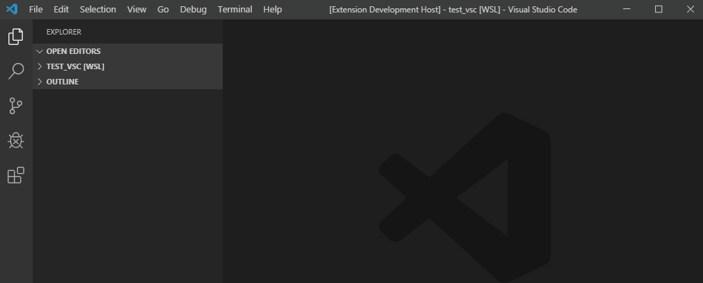
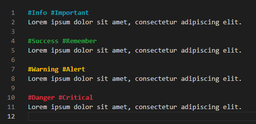

# VSCode Daily Notes

A simple text-based journal extension for Visual Studio Code.

## Features

* Access your Daily Notes conveniently with a shortcut: ```Alt+N```
* Date header is generated automatically, format is configurable
* Made in Markdown format so VSCode preview is possible with: ```Ctrl+Shift+V```
* Syntax highlighting for selected tags





## Usage

There are 2 ways to open Daily Notes file:

* VSCode Command: ```Ctrl+Shift+P``` or ```F1```, then type **Open Daily Notes**
* Shortcut Key-bind: Press ```Alt+N```

If the Daily Notes file is already open:

* Press ```Alt+N``` to generate new line of current date
* Press ```Ctrl+W``` to close the file
* Press ```Ctrl+S``` to save the file

You may save your note file anywhere:

* Create a new file ```daily-notes.md```, copy the path and set the ```dailyNotes.filePath``` in config.

## Extension Settings

This extension contributes the following settings:

* `dailyNotes.dateFormat`: Allows custom formatting of date header. Leave it empty to use default format. You can see formatting options [here](https://momentjs.com/docs/#/displaying/format/).

* `dailyNotes.filePath`: The complete location of the file to be used. When empty the file will be created in user's home directory.
  * Sample path for Windows: ```c:/Users/John/daily-notes.md```
  * Sample path for Mac or Linux: ```Users/john/daily-notes.md```

* `editor.tokenColorCustomizations.textMateRules`: You can customize tag colors here.

## Known Issues

* If you are using remote Windows Subsystem for Linux a.k.a WSL for VSCode, the file path format from Windows may not work.
This can be solved easily by using the file path from WSL e.g. ```/mnt/c/projects```.

## Installation
View in [VSCode Marketplace](https://marketplace.visualstudio.com/items?itemName=inaki.vscode-daily-notes) for more info.
1. In VSCode, go to Extensions ```Ctrl+Shift+X```
2. Type **VSCode Daily Notes** in search box
3. Click **Install**

## Contributing
- Pull requests are welcome for features and bug fixes
- Feel free to create issues when you encounter problems

## License
The extension is available as open source under the terms of the [MIT License](https://opensource.org/licenses/MIT).
